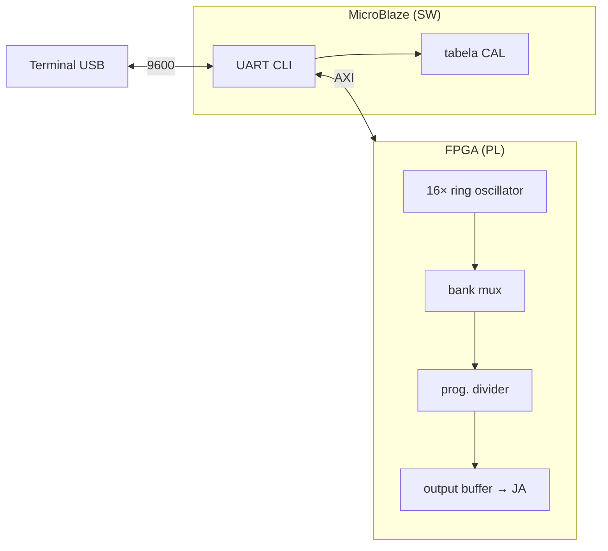

# Ring Oscillator Synthesizer — Arty S7-50

Syntezator częstotliwości oparty na **16 asynchronicznych pierścieniach LUT** (ring oscillators) w FPGA Spartan-7.
Sterowanie przez **UART** (MicroBlaze + terminal), pomiar w domenie **12 MHz**, wyjście na bufor scope.

**Repo:** https://github.com/ardysk/ring_oscilator_spartan7.git  
**Branch aktywny:** `master` — wersja V1 UART (to, co opisane poniżej)

---

## Co to robi (w skrócie)

1. W FPGA działa **16 niezależnych pierścieni** — każde oscyluje z inną prędkością (od ~100 MHz do ~300 kHz).
2. Firmware **kalibruje** je (`CAL`) i zapisuje tabelę: bank → częstotliwość + słowo strojenia `tune`.
3. Komenda **`SET`** wybiera bank + programowalny dzielnik i ustawia częstotliwość na wyjściu bufora (sygnał **zawsze** przechodzi przez dzielnik, minimum /2).
4. Komenda **`MEAS`** mierzy aktualną częstotliwość wyjścia (tryb ciągły do `Q`).
5. Przełącznik **SW0 = ON** fizycznie włącza pierścienie w PL (bez tego RO jest wyciszony).



---

## Sprzęt

| Element | Wartość |
|---------|---------|
| Płytka | Digilent **Arty S7-50** (XC7S50-CSGA324) |
| Zegar systemowy | 12 MHz |
| UART | USB-UART, typowo **COM13**, **9600 8N1** |
| Włączenie RO | przełącznik **SW0 = ON** |
| Wyjście scope | bufor na pinach JA (po `SET` / `BANK`) |
| Narzędzia | Vivado **2018.3**, SDK/XSDB do programowania |

---

## Szybki start na płytce

### 1. Zbuduj bitstream (PC)

```powershell
git clone https://github.com/ardysk/ring_oscilator_spartan7.git
cd ring_oscilator_spartan7

python scripts/gen_ro_presets.py
C:\Xilinx\Vivado\2018.3\bin\vivado.bat -mode batch -source scripts\build_v1.tcl
```

Wynik: `bitstreams/v1_uart.bit` (+ `bitstreams/v1_uart_timing.rpt`).

### 2. Firmware (opcjonalnie — jest prebuilt)

W repo jest gotowy `firmware/ro_ring_app.elf`. Źródła: `sw/v1_uart/`. Rebuild przez SDK: `scripts/build_v1_sw.tcl`.

### 3. Wgraj na płytkę (JTAG)

```powershell
.\scripts\flash_board.ps1
```

Lub ręcznie: `xsdb scripts\program_v1.tcl`. Wgrywa `bitstreams/v1_uart.bit` + firmware. Szczegóły: `WGRANIE.md`.

### 4. Terminal UART

- PuTTY / Tera Term / `python scripts/auto_tune.py`
- Port: **COM13** (lub inny z Menedżera urządzeń)
- **9600**, 8N1, brak flow control
- Ustaw **SW0 = ON**

---

## Interfejs UART — komendy CLI

Po połączeniu pojawia się prompt `RO>`. Wpisuj komendy wielkimi lub małymi literami.

| Komenda | Opis |
|---------|------|
| `HELP` lub `?` | Lista komend |
| `CLEAR` | Wyczyść tabelę kalibracji |
| `CAL` | Skalibruj wszystkie banki **B1…B16** (B1 = najszybszy) |
| `BANK <1-16>` | Podgląd wybranego banku na wyjściu bufora (bypass, bez dzielnika) |
| `SET <n>K` / `SET <n>M` | Ustaw docelową częstotliwość na wyjściu (np. `SET 1M`, `SET 100K`) |
| `MEAS` | Ciągły pomiar `f` co ~kilka sekund; **`Q`** = wyjście z trybu |

### Typowa sesja

```
RO> CLEAR
OK: CAL wyczyszczona
RO> CAL
CAL...
  B1 (hw 10)...
  ...
  B16: 312450 Hz  tune=0x000
RO> SET 1M
OK: 1000000 Hz
  jak: B11 (hw 11)  f_ring=5120000 Hz
       bufor+div /5  f_out=1024000 Hz
       target=1000000 Hz  blad~24000 Hz
RO> MEAS
MEAS (Q=koniec)
f = 1001234 Hz
RO> Q
RO> BANK 6
OK: B6 (hw 4) -> wyj. bufor.
  f_ring~45000000 Hz  tune=0x280  (bypass)
```

### Jak działa `SET`

Firmware wybiera bank z tabeli CAL, który **najlepiej** osiąga żądaną częstotliwość:

1. **Wybór banku** — minimalny błąd po zastosowaniu dzielnika.
2. **Dzielnik programowalny** — `f_out = f_ring / (2 × half)` lub bypass gdy target ≥ f_ring.
3. **Wyjście** — sygnał idzie przez bufor na pin scope (JA).

Po `SET` widać dokładnie: który bank (B1…B16), HW id, f_ring, dzielnik i szacowany błąd.

---

## Banki pierścieni B1…B16

Banki są posortowane od **najszybszego** (B1) do **najwolniejszego** (B16).
W logach `CAL` widać też **hw** — numer instancji w PL (0…15).

| CLI | HW | Typ | Zakres (orientacyjny) |
|-----|-----|-----|------------------------|
| B1 | 10 | tunable, tail 0 | 30–300 MHz |
| B2 | 0 | tunable, tail 0 | 30–250 MHz |
| B3 | 3 | tunable | 20–90 MHz |
| B4 | 1 | tunable | 15–80 MHz |
| B5 | 2 | tunable | 12–70 MHz |
| B6 | 4 | tunable | 8–55 MHz |
| B7 | 7 | tunable | 5–45 MHz |
| B8 | 8 | tunable | 4–35 MHz |
| B9 | 5 | tunable | 5–55 MHz |
| B10 | 9 | tunable | 2–25 MHz |
| B11 | 11 | tunable | 1–15 MHz |
| B12 | 6 | łańcuch 601 inv + /64 | 200 kHz–5 MHz |
| B13 | 12 | łańcuch 401 inv + /64 | 150 kHz–2 MHz |
| B14 | 13 | łańcuch 501 inv + /64 | 100 kHz–1.5 MHz |
| B15 | 14 | łańcuch 601 inv + /64 | 80 kHz–1 MHz |
| B16 | 15 | łańcuch 801 inv + /64 | 60 kHz–800 kHz |

Banki B1–B11 mają **12-bitowe strojenie** (`tune`, 0x000…0xFFF). Banki B12–B16 to długie łańcuchy inwerterów — bez strojenia, stała topologia.

---

## Architektura PL (skrót)

```
ring_inverter_tunable / ring_inverter_chain   ← 16 banków (ro_top.sv)
        ↓
ro_multi_div_mux          ← wybór banku + dzielnik programowalny
        ↓
ro_sig_buf                ← bufor wyjściowy (scope)
        ↓
ro_bank_prescale_mux      ← preskaler per-bank (pomiar wysokich f)
        ↓
ro_freq_measure @ 12 MHz ← licznik zboczy, okno ~5 ms (GATE=60000)
```

- **Pierścień** — pętla kombinacyjna LUT, bez taktu w torze propagacji.
- **Pomiar** — preskaler + licznik w 12 MHz; firmware rekonstruuje `f_ring` mnożąc przez `scale` per bank.
- **PBLOCK** — każdy bank ma przypisany region SLICE (`constraints/v1_uart/floorplan_ro_banks.xdc`, generowany przez `scripts/gen_ro_presets.py`).

Formuła pomiaru (uproszczona):

\[
f \approx \frac{N_{edges} \cdot f_{ref} \cdot scale}{N_{gate}}
\]

Domyślnie: `f_ref = 12 MHz`, `N_gate = 60000` (~5 ms).

---

## Struktura repozytorium (master)

```
ring_oscilator_spartan7/
├── README.md                          ← ten plik
├── ring_oscilator_prj.xpr             ← projekt Vivado
├── rtl/common/                        ← kanoniczne źródła RTL RO
├── ring_oscilator_prj.srcs/
│   ├── sources_1/new/                 ← RTL w projekcie Vivado
│   └── sources_1/bd/mb_ro_system/     ← Block Design (MicroBlaze + ro_axi)
├── constraints/v1_uart/               ← PBLOCK, floorplan TCL
├── sw/v1_uart/                        ← firmware MicroBlaze (CLI UART)
├── scripts/
│   ├── build_v1.tcl                   ← pełny build → bitstreams/v1_uart.bit
│   ├── gen_ro_presets.py              ← presety tune + floorplan XDC
│   ├── program_v1.tcl                 ← JTAG: bit + ELF
│   └── auto_tune.py                   ← automatyzacja UART / HIL test
└── bitstreams/                        ← wynik buildu (lokalnie, nie w git)
```

---

## Automatyzacja testów UART

```powershell
python scripts/auto_tune.py --hil-test --com COM13
```

Skrypt wysyła komendy CLI, sprawdza `SET` + `MEAS` i raportuje PASS/FAIL.

---

## Zużycie zasobów (orientacyjne)

Po implementacji 16 banków: **~11k / 32.6k Slice LUT (~33%)**.
Większość LUT to pierścienie i łańcuchy inwerterów w wolnych bankach.

---

## Rozwiązywanie problemów

| Problem | Co sprawdzić |
|---------|----------------|
| Brak odpowiedzi UART | Port COM, 9600 8N1, bitstream + ELF wgrany |
| `ERR: brak RO CSR` | Zły bitstream lub SW0=OFF |
| `CAL` → `FAIL` na wolnych bankach | SW0=ON; powtórz `CAL`; sprawdź `last_hz` w logu |
| `SET` → `ERR (najpierw CAL)` | Uruchom `CAL` po każdym `CLEAR` / resecie |
| Zła częstotliwość przy wysokich f | Normalne powyżej ~1–2 MHz na torze async; firmware używa predykcji dzielnika |

---

## Branch V2 — UART + wyświetlacz GC9A01 (PMOD JD)

Branch `feature/v2-dds-btn`: ten sam UART CLI co master + okrągły TFT **GC9A01** na **PMOD JD**:

| Pin JD | Sygnał |
|--------|--------|
| 1–2 | VCC, GND |
| 3 | SCL (SCK) |
| 4 | SDA (MOSI) |
| 7 | DC |
| 8 | CS |
| 9 | RST |

```powershell
git checkout feature/v2-dds-btn
python scripts/gen_ro_presets.py
vivado -mode batch -source scripts/build_v2_uart_tft.tcl
xsdb scripts/program_v2.tcl
```

Wynik: `bitstreams/v2_uart_tft.bit` — wyświetlacz pokazuje kolor zależny od zmierzonej częstotliwości na wyjściu scope.

---

## Licencja

Projekt laboratoryjny CSD Lab6, 2026.
