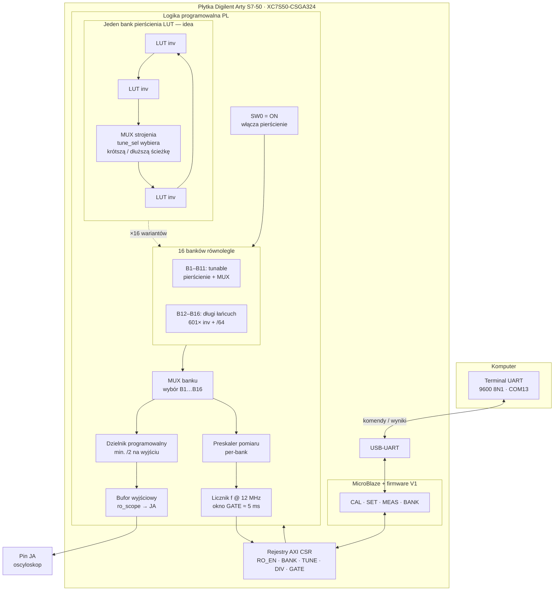

# aring_osc — Ring Oscillator Synthesizer (Arty S7-50)

**Projekt SDUP** — syntezator częstotliwości na **16 asynchronicznych pierścieniach LUT** w FPGA Spartan-7.  
**Płytka:** Digilent **Arty S7-50** (XC7S50-CSGA324). Sterowanie przez **UART** (MicroBlaze + terminal), pomiar w domenie **12 MHz**, wyjście na bufor scope (nagłówek **JA**).

**Autorzy:** A. Kowalczyk, K. Skalka  
**Repo:** https://github.com/ardysk/ring_oscilator_arty-s7.git  
**Wersja aktywna:** V1 UART (`main`)

---

## Zasada działania

1. W FPGA działa **16 niezależnych pierścieni** — każde oscyluje z inną prędkością (od ~100 MHz do ~300 kHz).
2. Firmware **kalibruje** je (`CAL`) i zapisuje tabelę: bank → częstotliwość + słowo strojenia `tune`.
3. Komenda **`SET`** wybiera bank + programowalny dzielnik i ustawia częstotliwość na wyjściu bufora (sygnał **zawsze** przechodzi przez dzielnik, minimum /2).
4. Komenda **`MEAS`** mierzy aktualną częstotliwość wyjścia (tryb ciągły do `Q`).
5. Przełącznik **SW0 = ON** fizycznie włącza pierścienie w PL.

Poniżej uproszczony schemat idei — jak sygnał przechodzi od pierścienia LUT przez multipleksery i dzielniki do pomiaru i wyjścia scope, oraz gdzie wchodzi UART:



---

## Sprzęt

| Element | Wartość |
|---------|---------|
| Płytka docelowa | Digilent **Arty S7-50** — FPGA **XC7S50-CSGA324** |
| Zegar systemowy | 12 MHz |
| UART | USB-UART, typowo **COM13**, **9600 8N1** |
| Włączenie RO | przełącznik **SW0 = ON** |
| Wyjście scope | bufor na pinach JA |
| Narzędzia | Vivado **2018.3**, XSDB do programowania |

---

## Szybki start (po sklonowaniu)

```powershell
git clone https://github.com/ardysk/ring_oscilator_arty-s7.git
cd ring_oscilator_arty-s7
.\scripts\flash_and_uart.ps1
```

Wgrywa `bitstreams/v1_uart.bit` + `firmware/ro_ring_app.elf`. Szczegóły: `WGRANIE.md`.

Terminal: **COM13**, **9600 8N1**, **SW0=ON**, potem `HELP`.

### Rebuild bitstreamu (opcjonalnie)

```powershell
python scripts\gen_ro_presets.py
.\scripts\build_bitstream.ps1
.\scripts\flash_and_uart.ps1
```

---

## Komendy UART

| Komenda | Opis |
|---------|------|
| `HELP` / `?` | Lista komend |
| `CLEAR` | Wyczyść tabelę kalibracji |
| `CAL` | Skalibruj banki **B1…B16** (B1 = najszybszy) |
| `BANK <1-16>` | Podgląd banku na wyjściu bufora |
| `SET <n>K` / `SET <n>M` | Ustaw docelową częstotliwość na wyjściu |
| `MEAS` | Ciągły pomiar `f`; **`Q`** = wyjście |

### Typowa sesja

```
RO> CLEAR
RO> CAL
RO> SET 1M
RO> MEAS
RO> Q
RO> BANK 6
```

---

## Banki B1…B16

| CLI | HW | Typ | Zakres (orient.) |
|-----|-----|-----|------------------|
| B1 | 10 | tunable | 30–300 MHz |
| B2 | 0 | tunable | 30–250 MHz |
| B3 | 3 | tunable | 20–90 MHz |
| B4 | 1 | tunable | 15–80 MHz |
| B5 | 2 | tunable | 12–70 MHz |
| B6 | 4 | tunable | 8–55 MHz |
| B7 | 7 | tunable | 5–45 MHz |
| B8 | 8 | tunable | 4–35 MHz |
| B9 | 5 | tunable | 5–55 MHz |
| B10 | 9 | tunable | 2–25 MHz |
| B11 | 11 | tunable | 1–15 MHz |
| B12 | 6 | łańcuch 601 inv + /64 | 200 kHz–5 MHz |
| B13–B16 | 12–15 | łańcuchy LUT + /64 | ~60 kHz–2 MHz |

---

## Architektura V1

```
ring_inverter_tunable / ring_inverter_chain   ← 16 banków (ro_top.sv)
        ↓
ro_multi_div_mux          ← wybór banku + dzielnik
        ↓
ro_sig_buf                ← bufor wyjściowy (scope)
        ↓
ro_bank_prescale_mux      ← preskaler per-bank
        ↓
ro_freq_measure @ 12 MHz ← GATE=60000 (~5 ms)
```

---

## Struktura repozytorium

```
ring_oscilator_arty-s7/
├── README.md
├── WGRANIE.md
├── firmware/ro_ring_app.elf      ← gotowy firmware V1
├── bitstreams/v1_uart.bit        ← gotowy bitstream V1
├── rtl/common/                   ← RTL V1 (kanoniczne)
├── sw/v1_uart/                   ← źródła firmware
├── scripts/                      ← build + flash
├── ring_oscilator_prj.xpr
└── docs/                         ← rejestry AXI (patrz docs/README.md)
```

Katalogi `rtl/v2_*`, `rtl/v3_*`, `sw/v3_tft`, `versions/` — **archiwum** starszych wariantów, nie używane w V1.

---

## Rozwiązywanie problemów

| Problem | Co sprawdzić |
|---------|----------------|
| Brak odpowiedzi UART | COM, **9600** 8N1, bitstream + ELF wgrany |
| `ERR: brak RO CSR` | Zły bitstream lub SW0=OFF |
| `CAL` → FAIL | SW0=ON; powtórz `CAL` |
| `SET` → błąd | Najpierw `CAL` po `CLEAR` |

---

## Autorzy

Projekt SDUP **aring_osc** — A. Kowalczyk, K. Skalka.
