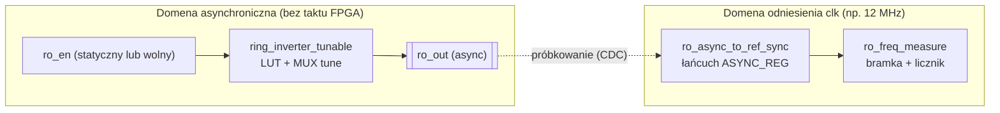

# Plan: asynchroniczny pierścień jako „zegar” ROSC + synchroniczny pomiar w domenie odniesienia

## Cel laboratorium / projektu

Zbudować **oscylator pierścieniowy** z inwersorów realizowanych w **LUTach** (z możliwością strojenia opóźnień przez mux), który działa jako **źródło taktu niezwiązanego z głównym zegarem systemowym** na FPGA. Nie ma tu „wzmacniacza zegara” liczącego w tej samej sieci co `clk_12mhz` ani PLL podłączonego *do samodzielnej propagacji fal w pętli* — pętla jest **czysto kombinacyjna ze sprzżeniem zwrotnym** (z enable typu NAND), więc faza i moment próbkowania są **względem siebie asynchroniczne**.

Drugim blokiem funkcjonalnym jest **pomiar orientacyjnej częstotliwości** `f_ro`: w **domenie odniesienia** (np. 12 MHz od pinu lub z systemu MB) przez zadaną „bramkę czasu” (`GATE`) liczone są **zbocza** zsynchronizowanego kopii przebiegu z pierścienia; z tego w oprogramowaniu szacuje się `f_ro`.

## Architektura (dwie wyraźnie oddzielone ścieżki)

| Element | Rola |
|--------|------|
| **Pierścień** | Generuje periodycznie (idealnie trójkątny przebieg wewnętrzny, wyjście to „wysoki / niski” z peryodą zależną od opóźnień łańcucha). **Nie** jest taktowany przez `clk`. |
| **`ro_async_to_ref_sync`** | Łączy `ro_out` → `clk`: zmniejsza ryzyko metastabilności wejść do synchronicznej logiki (**nie** nakłada współfazowości z OSC). |
| **`ro_freq_measure`** | Bramka czasu wyrażona w **cyklach `clk`**: liczy zmiany poziomu na wyjściu synchronizatora (`meas_edge_count`). |
| **JA / `arty_scope_freq_mux`** *(opcjonalnie)* | Tylko **obserwacja** na oscilloskopie: próbkowanie przy wyższym MMCM żeby kształt był czytelny — **nie** jest to „źródło zegara” pierścienia. |

## Jak oszacować częstotliwość (wprost z rejestru / LED)

Po zakończeniu pomiaru (sticky `DONE`):

- Czas bramki: \(T_{\text{gate}} = \dfrac{\texttt{gate\_cycles}}{f_{\text{ref}}}\)  
  przy `gate_cycles` wpisanym do rejestru `GATE`, \(f_{\text{ref}}\) ≈ częstotliwość `clk` próbkującego licznik.

- **`meas_edge_count`** liczy **przejścia poziomu** zsynchronizowanego przebiegu w oknie \(T_{\text{gate}}\) (wzrost lub spadek poziomu: jedno „zbocze” w sensie próbkowanym przy `clk`). Przy uproszczonym założeniu, że `f_ro` jest **wiele razy niższe** od \(f_{\text{ref}}\) i przez okno śledzisz **prawie każdy** przebieg przemiatania przez synchronizator, orientacyjnie:

  \[
  f_{\mathrm{ro}} \approx \frac{\texttt{meas\_edge\_count}}{2 \cdot T_{\text{gate}}}
  = \frac{\texttt{meas\_edge\_count} \cdot f_{\mathrm{ref}}}{2 \cdot \texttt{gate\_cycles}}
  \]

(W praktyce przy bardzo dużej `f_ro` wobec próbkowania błąd bywa duży — warto dobierać **`tune`** / presety żeby `f_ro` była dostatecznie niska przy danym `f_ref`. Dokładniejsze metody to dłuższa bramka lub sprzętowy divider przed synchronizacją.)

## Świadomy projekt inverterów LUT

Moduł `ring_inverter_tunable.sv` trzyma opóźnienia w strukturze `assign` przez LUT (SYNTH), z atrybutami `KEEP` / `DONT_TOUCH` tam, gdzie trzeba, żeby optymalizator nie zwinął pętli. Strojenie (`tune_sel` / mux) ma **zbliżyć** ścieżki opóźnień między wariantami i dać sensowną skalę `f_ro` na laboratorium.

## Co jest zaimplementowane w RTL

- **Asynchroniczny pierścień**: `ring_inverter_tunable` + `ro_top` — **bez** wejścia taktu FPGA do ścieżki propagacji OSC.
- **Synchronizacja wyłącznie na ścieżce „do licznika”**: `ro_async_to_ref_sync` + stan FSM w `ro_freq_measure` w obrębie `clk`.
- **Obserwacja analogicznego „prostokąta” na JA**: `arty_scope_freq_mux` — osobna ścieżka wizualna.

## Lista kontrolna w laboratorium

1. Ustal `f_ref` (np. dokładnym mierzeniem lub specyfikacją quartzu 12 MHz na Arty).  
2. Ustaw `GATE` na dłużej dla mniejszego rozrzutu statycznego przy małej `f_ro`.  
3. Po `meas_done` odczytaj `EDGES`; policz \(f_{\mathrm{ro}}\) jak wyżej.  
4. Na oscyloskopie: skalę i BW (np. BW limit przy sondzie) dostosować żeby uniknąć „ładnych” artefaktów przy bardzo ostrych zboczach.
